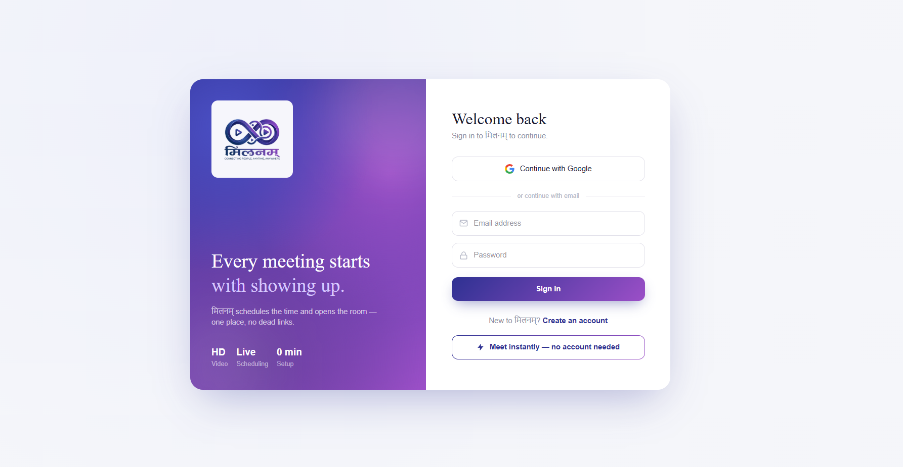
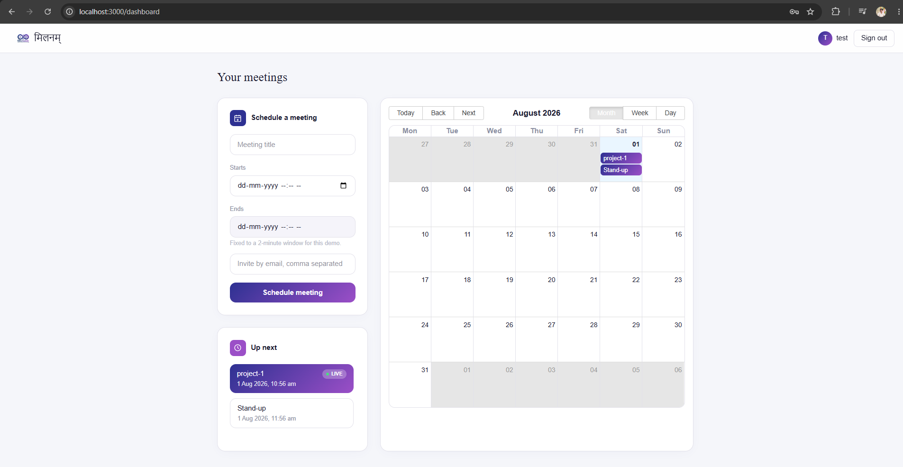
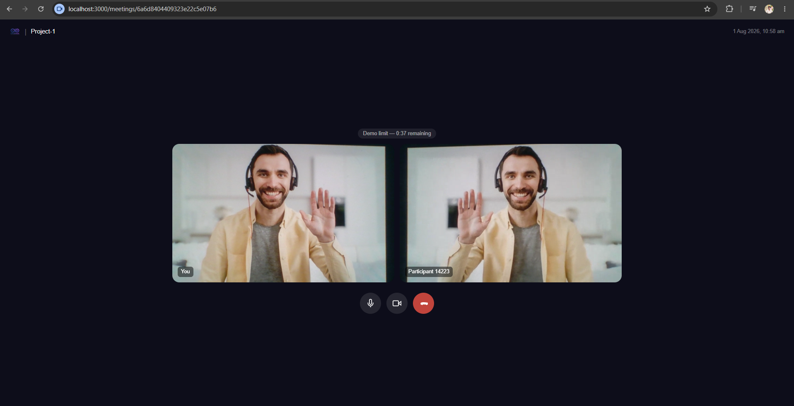
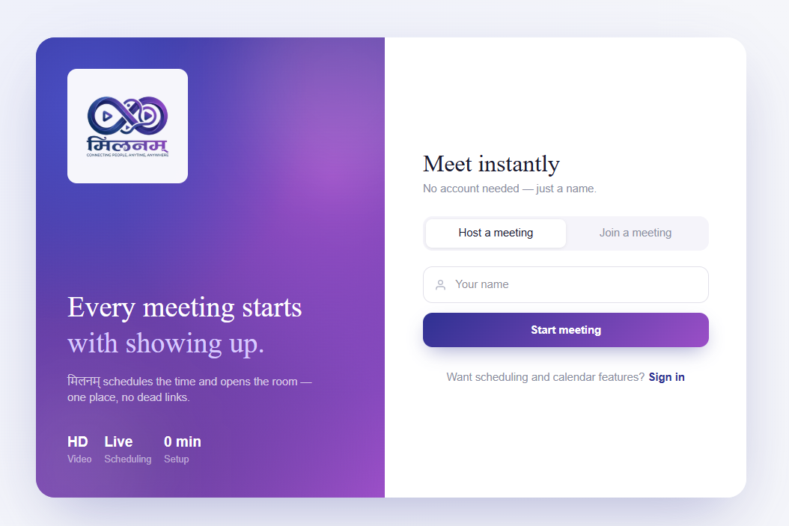
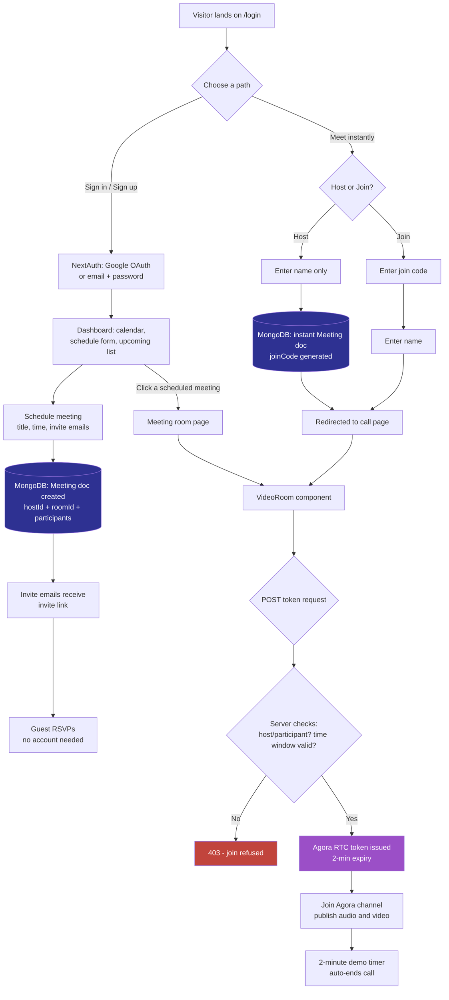

# मिलनम् (Milanam)

**A full-stack video meeting platform — schedule, invite, and meet, all in one place.**

मिलनम् (Sanskrit for "meeting" / "confluence") is a Zoom/Google Meet–style application built from scratch with Next.js, MongoDB, NextAuth, and Agora's real-time video SDK. It supports both **scheduled meetings with calendar invites** and **instant no-account meetings** via a shareable join code.

> ⚠️ **Demo note:** Calls are capped at **2 minutes** (enforced both client-side and via Agora token expiry) to keep this public showcase's video API usage bounded. See [Why the 2-minute limit](#why-the-2-minute-limit) below.

### 🔗 [Live Demo](https://milanam-khaki.vercel.app/)

<!-- SCREENSHOT: hero/login split-panel screen -->


---

## ✨ Features

### Scheduling & Calendar
- Create, view, and manage meetings on a full calendar (month/week/day views)
- Invite participants by email — no account required for invitees to RSVP
- Public accept/decline invite page, distinct per-guest tracking
- Live "up next" panel that highlights meetings currently in progress

### Instant Meetings
- Start a meeting with just a name — no sign-up, no email
- Auto-generated 6-character join code (ambiguity-free alphabet — no `0`/`O`, `1`/`I`/`l` confusion)
- Anyone with the code can join by typing their name — no account needed

### Video Calling
- Real-time video via **Agora RTC SDK** — mute/unmute, camera on/off
- Dynamic multi-participant grid layout
- Graceful fallback if a device (camera *or* mic) is missing — join with whatever hardware is available, like real conferencing apps do
- Server-issued, time-boxed access tokens — the video API credential (Agora App Certificate) never touches the browser

### Auth & Security
- Google OAuth **and** email/password (bcrypt-hashed) via NextAuth
- Every meeting API route enforces host/participant permission checks server-side
- Scheduled calls can only be joined within their time window — enforced at the token-issuance layer, not just hidden in the UI
- Passwords excluded from query results by default (Mongoose `select: false`)

### Design
- Custom visual identity — gradient mesh backgrounds, glassmorphic login, dark-mode call screen
- Fully responsive (distinct mobile/desktop layouts, not just scaled-down desktop)

<!-- SCREENSHOT: dashboard with calendar -->


<!-- SCREENSHOT: active video call with multiple tiles -->


<!-- SCREENSHOT: instant meeting host/join screen -->


---

## 🛠️ Tech Stack

| Layer | Technology |
|---|---|
| Framework | Next.js 15 (App Router) |
| Auth | NextAuth.js (Google OAuth + credentials) |
| Database | MongoDB + Mongoose |
| Video | Agora RTC SDK |
| Styling | Tailwind CSS v4 |
| Calendar UI | react-big-calendar |

---

## 🔀 How it works



**The one security-relevant path to notice:** every route into `VideoRoom` — whether from a scheduled meeting or an instant one — passes through the same server-side check before a video token is ever issued. The client never decides whether someone is allowed into a call; the server does, at the moment the token is requested.

---

## 🏗️ Architecture highlights

A few decisions worth calling out for anyone reviewing the code:

- **Server-issued video tokens.** `POST /api/agora/token` is the only place the Agora App Certificate is used. It validates the requester is the host or an invited participant *and* that the current time falls inside the meeting's scheduled window before issuing a token — access control lives at the credential-issuance layer, not just in the UI.
- **Decoupled identifiers.** Each meeting has three separate IDs: MongoDB's `_id` (database identity), a `roomId` (Agora channel name), and — for instant meetings — a human-typeable `joinCode`. None of them leak into each other's role.
- **Shared video component.** Scheduled and instant meetings both render the same `VideoRoom` component, parameterized by a `fetchToken` function — no duplicated call logic between the two meeting types.
- **Device-fallback join flow.** Camera and microphone availability are checked independently; a user missing one device can still join using the other, rather than being blocked outright.

---

## 🚀 Getting started locally

```bash
git clone <your-repo-url>
cd milanam
npm install
```

Copy `.env.example` to `.env.local` and fill in:
- `MONGODB_URI` — MongoDB Atlas connection string
- `NEXTAUTH_SECRET` — generate via `openssl rand -base64 32`
- `GOOGLE_CLIENT_ID` / `GOOGLE_CLIENT_SECRET` — from [Google Cloud Console](https://console.cloud.google.com/apis/credentials)
- `AGORA_APP_ID` / `AGORA_APP_CERTIFICATE` / `NEXT_PUBLIC_AGORA_APP_ID` — from [Agora Console](https://console.agora.io)

```bash
npm run dev
```

Visit `http://localhost:3000`.

---

## Why the 2-minute limit

This project is deployed publicly as a portfolio piece. Unrestricted video calls on a public demo could be used by anyone to run indefinite Agora sessions against my API credentials. Capping call duration keeps the showcase safe to leave live without incurring runaway usage — the underlying code supports arbitrary-length calls (see `CALL_LIMIT_SECONDS` in `components/VideoRoom.jsx` and `expireSeconds` in `lib/agora.js`) and the limit is simply a configuration value for this deployment.

---

## 👤 Author

**Manan Patel** *JavaScript Developer | Full-Stack Web Developer Node.js · React.js · TypeScript*

[](https://linkedin.com/in/manan-patel-dev)
[](https://github.com/manan-js-dev)
[](mailto:manan.js.dev@gmail.com)

---

## 📄 License

MIT — feel free to explore, fork, or reach out with questions.
